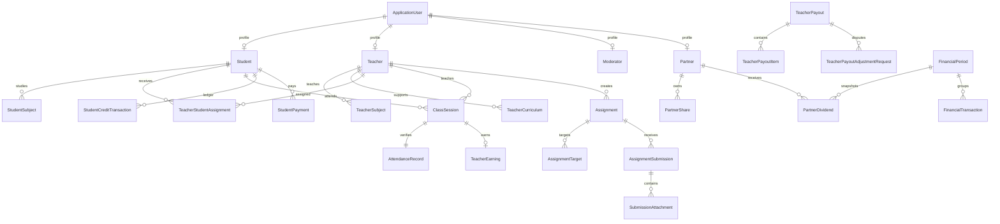

# ERD

```mermaid
erDiagram
  ApplicationUser ||--o| Student : profile
  ApplicationUser ||--o| Teacher : profile
  ApplicationUser ||--o| Moderator : profile
  ApplicationUser ||--o| Partner : profile
  Student ||--o{ StudentSubject : studies
  Teacher ||--o{ TeacherSubject : teaches
  Teacher ||--o{ TeacherCurriculum : supports
  Teacher ||--o{ TeacherStudentAssignment : assigned
  Student ||--o{ TeacherStudentAssignment : receives
  Student ||--o{ ClassSession : attends
  Teacher ||--o{ ClassSession : teaches
  ClassSession ||--|| AttendanceRecord : verifies
  Student ||--o{ StudentCreditTransaction : ledger
  Student ||--o{ StudentPayment : pays
  Teacher ||--o{ Assignment : creates
  Assignment ||--o{ AssignmentTarget : targets
  Assignment ||--o{ AssignmentSubmission : receives
  AssignmentSubmission ||--o{ SubmissionAttachment : contains
  ClassSession ||--o| TeacherEarning : earns
  TeacherPayout ||--o{ TeacherPayoutItem : contains
  TeacherPayout ||--o{ TeacherPayoutAdjustmentRequest : disputes
  FinancialPeriod ||--o{ PartnerDividend : snapshots
  FinancialPeriod ||--o{ FinancialTransaction : groups
  Partner ||--o{ PartnerShare : owns
  Partner ||--o{ PartnerDividend : receives
```

الحذف Cascade مقيد افتراضيًا. الجداول التشغيلية المناسبة تستخدم soft delete؛ AuditLog وFinancialTransaction لا يملكان مسار حذف.
